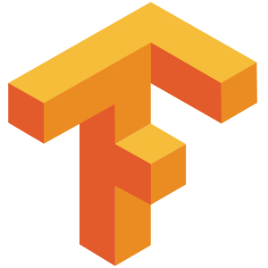

## Hello there, I'm Mohamed👋
 

I'm a data scientist with a strong theoretical understanding of the inner workings of machine/deep learning algorithms and the underlying mathematics, 
and equipped with the best-practices for using these algorithms to solve real-world problems

 
- 🔭 I just launched my first course: [Become A VS Code SuperHero!][course]!
- 🌱 I’m currently learning everything 🤣
- 👯 I’m looking to collaborate with other content creators
- 🥅 2020 Goals: Contribute more to Open Source projects
- ⚡ Fun fact: I love to draw and play guitar / drums

### Connect with me:

[][website]

[][linkedin]

 

### Languages and Tools:

 
 

---

### 📺 Latest YouTube Videos

<!-- YOUTUBE:START -->
- [How to Check Ownership of an NFT in your Collection using MetaMask &amp; Netlify Functions!! 😻](https://www.youtube.com/watch?v=g2h-N_E1up0)
- [STACKr News Weekly: Trade Stocks with JavaScript, Create an NFT Landing Page, Ultimate Pandas Guide!](https://www.youtube.com/watch?v=_fuYgCxbvLw)
- [How To Google Like A Pro! Top 18 Google Search Tips &amp; Tricks 2022](https://www.youtube.com/watch?v=LrVN52dhRxY)
- [How to create an NFT website landing page &amp; Deploy for FREE &lpar;Complete tutorial | EASY!&rpar;](https://www.youtube.com/watch?v=WZQSVv67NBc)
- [STACKr News Weekly: Crypto, Tech Jobs, and Remix](https://www.youtube.com/watch?v=UUjIUNMlFno)
<!-- YOUTUBE:END -->

➡️ [more videos...](https://youtube.com/codestackr)

---

### 📕 Latest Blog Posts

<!-- BLOG-POST-LIST:START -->
- [How To Pass Application Tracking Systems &lpar;ATS&rpar; &amp; Get Interviews - Resume Tips for Software Developer](https://dev.to/codestackr/how-to-pass-application-tracking-systems-ats-get-interviews-resume-tips-for-software-developer-4bmo)
- [Microinteractions: Password Validation Animation](https://dev.to/codestackr/microinteractions-password-validation-animation-5629)
- [Notion + YouTube - A Powerful Combination for Productivity](https://dev.to/codestackr/notion-youtube-a-powerful-combination-for-productivity-1def)
- [Regular Expressions &lpar;RegEx&rpar; Crash Course](https://dev.to/codestackr/regular-expressions-regex-crash-course-248n)
- [Emmet Part 2 - Advanced](https://dev.to/codestackr/emmet-part-2-advanced-4c65)
<!-- BLOG-POST-LIST:END -->

➡️ [more blog posts...](https://codestackr.com)

---

  
:zap: Recent GitHub Activity

  
<!--START_SECTION:activity-->
1. ❗️ Closed issue [#49](https://github.com/codeSTACKr/create-10k-nft-collection/issues/49) in [codeSTACKr/create-10k-nft-collection](https://github.com/codeSTACKr/create-10k-nft-collection)
2. 🗣 Commented on [#49](https://github.com/codeSTACKr/create-10k-nft-collection/issues/49) in [codeSTACKr/create-10k-nft-collection](https://github.com/codeSTACKr/create-10k-nft-collection)
3. ❗️ Closed issue [#50](https://github.com/codeSTACKr/create-10k-nft-collection/issues/50) in [codeSTACKr/create-10k-nft-collection](https://github.com/codeSTACKr/create-10k-nft-collection)
4. ❗️ Closed issue [#51](https://github.com/codeSTACKr/create-10k-nft-collection/issues/51) in [codeSTACKr/create-10k-nft-collection](https://github.com/codeSTACKr/create-10k-nft-collection)
5. 🗣 Commented on [#51](https://github.com/codeSTACKr/create-10k-nft-collection/issues/51) in [codeSTACKr/create-10k-nft-collection](https://github.com/codeSTACKr/create-10k-nft-collection)
<!--END_SECTION:activity-->

  
:zap: GitHub Stats

  

[website]: https://codeSTACKr.com
[course]: http://vsCodeHero.com
[twitter]: https://twitter.com/codeSTACKr
[youtube]: https://youtube.com/codeSTACKr
[instagram]: https://instagram.com/codeSTACKr
[linkedin]: https://linkedin.com/in/codeSTACKr
[webdevplaylist]: https://www.youtube.com/playlist?list=PLkwxH9e_vrAJ0WbEsFA9W3I1W-g_BTsbt
[jsplaylist]: https://www.youtube.com/playlist?list=PLkwxH9e_vrALRJKu7wfXby3MKeflhTu6B
[cssplaylist]: https://www.youtube.com/playlist?list=PLkwxH9e_vrALSdvZuEh6gqQdmDoDIoqz4
[reactplaylist]: https://www.youtube.com/playlist?list=PLkwxH9e_vrAK4TdffpxKY3QGyHCpxFcQ0