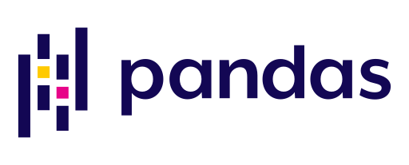
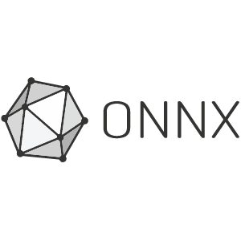

## Hello there, I'm Mohamed👋

I'm a data scientist with a strong theoretical understanding of the inner workings of machine/deep learning algorithms and the underlying mathematics, and equipped with the best-practices for utilizing these algorithms to solve real-world problems. 

 
 ### I'm experienced in 
- Classical Machine learning: regression, trees, K-NN, SVM, ensembles, K-means, PCA, etc.
- Computer Vision: image classification, semantic segmentation, object detection using architechtures such as       ResNet, Inception, FCN, UNet, DeepLab, Faster RCNN, RetinaNet, and YOLO
- Deployment using AWS
- Exploratory data analysis
- web scraping
- building APIs

### I'm currently learning (check resources below)
- Transformers and their applications to NLP and computer vision
- Object tracking using Yolo and deepsort

### Connect with me:

[][website]

[][linkedin]

 

### Languages and Tools:

 

### Resources
- [Transformer illustrated](https://jalammar.github.io/illustrated-transformer/)
- [Transformers from scratch](https://e2eml.school/transformers.html)
- [Natural Language Processing with Transformers](https://www.amazon.com/Natural-Language-Processing-Transformers-Applications/dp/1098103246)
- [The annotated Transformer](https://nlp.seas.harvard.edu/2018/04/03/attention.html)
- [Attention Mechanisms in Computer Vision: A Survey](https://arxiv.org/abs/2111.07624)
 

[website]: https://www.freelancer.com/u/mzdwedar
[linkedin]: https://www.linkedin.com/in/mzdwedar